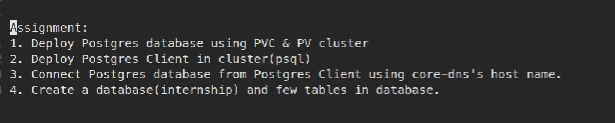

# kubernetes-assignment2



## Q.1.

### Step 1: Create PV

1.1 Create directory structure for `hostPath` i.e place which the PV will use as storage. 

```docker
mkdir -p /pv/postgres
sudo chown $USER:$USER -R /pv
```

1.2 Create PV

```docker
apiVersion: v1
kind: PersistentVolume
metadata:
  name: pv-lft
spec:
  persistentVolumeReclaimPolicy: Retain
  accessModes:
    - ReadWriteOnce
  capacity:
    storage: 1Gi
  hostPath:
    path: /pv/postgres
```

Create it using `kubectl create -f pv.yml`


### Step 2: Create PVC

```docker
apiVersion: v1
kind: PersistentVolumeClaim
metadata:
  name: postgres-pv-claim
spec:
  storageClassName: ''
  accessModes:               
    - ReadWriteOnce       
  resources:
    requests:
      storage: 1Gi
```

Create it using `kubectl create -f pvc.yml`


### Step 3: Create Postgres db Pod

```docker
apiVersion: v1
kind: Pod
metadata:
  name: postgres-pod
spec:
  
  volumes:
    - name: myvol
      persistentVolumeClaim:
        claimName: postgres-pv-claim  
  containers:
      - name: postgres-container
        image: rimalroshan/postgres
        volumeMounts:
          - mountPath: "/var/lib/postgres/data"
            name: myvol
```

Create it using `kubectl create -f pod.yml`


## Q.2.

### Step 1: Create psql client

Create a docker image with psql client installed

For that first create a `Dockerfile` and use the image

```docker
**FROM ubuntu
RUN apt update
RUN apt install -y postgresql-client-12
CMD ["sleep","infinity"]**
```

Run `docker build -t rimalroshan/psql .`


Import the image to minikube

```docker
minikube image load rimalroshan/psql
```

### Step 2: Create a service for the database

```docker
apiVersion: v1
kind: Service
metadata:
  labels:
    db: postgres
  name: db-service
spec:
  ports:
  - port: 5432
    protocol: TCP
    targetPort: 5432
  selector:
    db: postgres
  type: ClusterIP

```


## Q.3.

### Step 1: Run the psql client on the cluster

```docker
apiVersion: v1
kind: Pod
metadata:
  name: psql-pod
  labels:
   client: psql
spec:
  containers:
      - name: psql-container
        image: rimalroshan/psql
        imagePullPolicy: Never
        env:
        - name: PGPASSWORD
          value: lfttest
```

Run `kubectl create -f podpsql.yaml` to run the pod with psql installed.


## Q.3.

### Step 1: Exec into the psql pod

```docker
kubectl exec postgres-pod -it -- /bin/bash
```

### Step 2: Connect to the db

```docker
psql -h db-service.default.svc.cluster.local -p 5432 -U postgres
```


## Q.4.

create few database and few tables in db

### Step 1: Create db

```docker
create database internship
\l # to list databases
```


### Step 2: Create tables

Create first table

```docker
psql> \c internship #connect to internship db
internship=# CREATE TABLE student(id INT PRIMARY KEY, name VARCHAR, age INT);
internship=#\d student
internship=#\dt
```


Create second table

```docker
internship=# CREATE TABLE mentor(id INT PRIMARY KEY, name VARCHAR, hours INT);
internship=#\d mentor
internship=#\dt
```


### Findings

(from docker hub)

To customize postgres to allow connections from other containers  in same pod or other containers in another pods. (By default the docker postgres image allowed connection from other containers without any modification but if it doen't work you need to create a  custom postgres image and configure the file to listen accordingly)

```
$ # get the default config
$ docker run -i --rm postgres cat /usr/share/postgresql/postgresql.conf.sample > my-postgres.conf

$ # customize the config
Important note: you must set listen_addresses = '*'so that other containers will be able to access postgres.

$ # run postgres with custom config
$ docker run -d --name some-postgres -v "$PWD/my-postgres.conf":/etc/postgresql/postgresql.conf -e POSTGRES_PASSWORD=mysecretpassword postgres -c 'config_file=/etc/postgresql/postgresql.conf'
```
